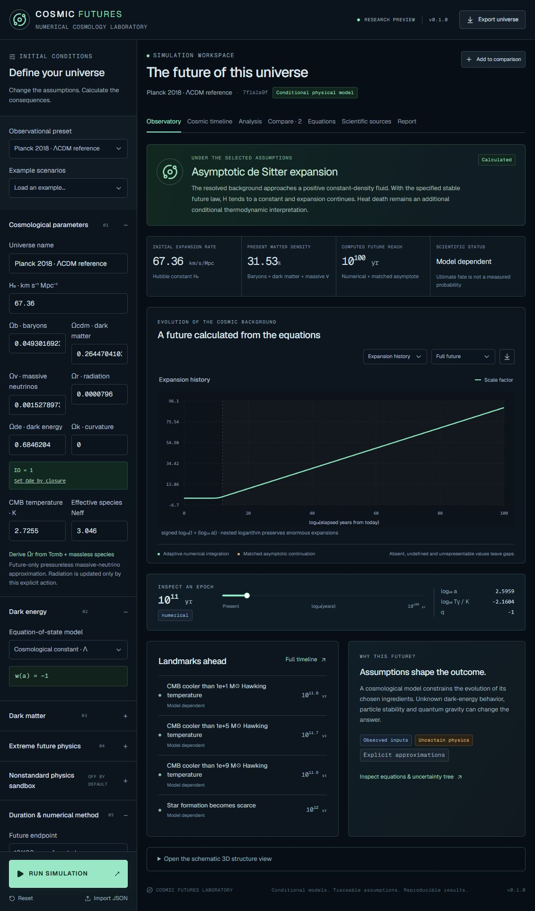

# Cosmic Futures Laboratory

[](https://github.com/pandakingpunc/cosmic-futures-laboratory/actions/workflows/ci.yml)
[](https://doi.org/10.5281/zenodo.22343412)

A numerical laboratory for exploring **conditional futures of the Universe**. Configure cosmological fluids, calculate their evolution, inspect assumptions and compare the results. The application and publication materials are in English.

Source repository: [pandakingpunc/cosmic-futures-laboratory](https://github.com/pandakingpunc/cosmic-futures-laboratory).

This is version **0.1.0, a research software preview**. Its core has analytic regression tests and an independent SciPy comparison. It has not undergone external scientific peer review. It does not calculate a unique or observationally measured probability for the ultimate cosmic fate.



## Quick start

Requirements: Node.js 24.x and npm. No API key, Python installation, or database is needed to use the web application.

```sh
npm ci
npm run dev
```

Open the local URL printed by the development server, normally `http://localhost:3000`. Choose a preset or change the initial conditions and press **RUN SIMULATION**. Modified inputs are marked until recalculated. Save universes to the comparison bench, inspect epochs with the time slider, and export JSON, CSV, SVG or a Markdown scientific report. Comparison slots live in memory; export results before reloading.

```sh
npm test
npm run typecheck
npm run lint
npm run examples
npm run build
```

The production build targets Cloudflare Workers through Vinext and Sites. `npm start` serves the built Worker locally. Sites hosting metadata contains this project's deployment ID; a fork must remove that ID before registering a separate deployment. Scientific calculations and local development do not require a Sites account.

## Deploy to Vercel

Import this GitHub repository into Vercel with the repository root as **Root Directory** and **Node.js 24.x**. The committed `vercel.json` selects the Vercel build automatically: **Framework Preset: Other**, **Build Command: `npm run build:vercel`**, **Install Command: `npm ci`**, and **Output Directory: automatic**. No environment variables are required.

The Vercel build uses Vinext and Nitro to emit both static assets and the server function under `.vercel/output`. This serves the observatory and `/api/simulate` / `/api/observations`. A Cloudflare `dist` folder by itself is not a Vercel deployment and can produce `404: NOT_FOUND`.

```sh
npm run build:vercel
npm run validate:vercel
```

See [the Vercel deployment guide](docs/vercel.md) for updating an existing deployment that returned 404. The archived version 0.1.0 predates this deployment adapter; deploy the current `main` branch to use it.

## Scientific scope

- Adaptive Dormand–Prince 5(4) integration of future-only FLRW expansion and conservative dark-matter-to-radiation transfers.
- Λ, constant-w, CPL, bounded future continuation, and safely parsed custom `w(a)` / `w(z)` expressions.
- Stable, decaying, annihilating, warm-fluid and phenomenologically interacting dark matter. Particle identity is not assumed known.
- Regular time-domain integration through turnaround for supported closed or negative-vacuum constant-fluid models.
- Proven single-fluid asymptotic continuation, with explicit numerical boundaries for unsupported models. Nested logarithms represent expansion at endpoints up to 10^1000 elapsed years.
- Representative black-hole Hawking temperatures, ideal evaporation times and mass histories; illustrative stellar and particle-survival tracers.
- Seeded ensembles, user-supplied covariance or posterior rows, finite-difference sensitivity and a two-dimensional parameter sweep.
- Conditional timelines, schematic 3D tracer groups, equations, source provenance, reports and reproducible example runs.
- An optional nonstandard sandbox with timed interventions and explicit failure diagnostics.

See [the mathematical model](docs/methodology.md), [supported features and boundaries](docs/scope.md), [data provenance](docs/data-provenance.md), and [validation](docs/validation.md).

## Observational inputs

The versioned review is dated **2026-09-05**. The default is a documented Planck 2018 flat-ΛCDM reference, not a claim that all observations have one unique best fit. [Planck VI](https://arxiv.org/abs/1807.06209) supplies H₀=67.36±0.54 km/s/Mpc and Ωm=0.3153±0.0073 (68% marginal constraints). Radiation and the baryon/CDM/neutrino split have explicit transformation notes.

The [DESI July/August 2026 update](https://arxiv.org/html/2607.27410v3) is included alongside historical results and dataset-combination caveats. CPL can fit the observed past while giving an unreliable extrapolation into the future. A P-ACT-H₀ illustration is explicitly labeled as having an illustrative composition. No unavailable Euclid posterior or cosmological covariance has been invented.

`data/observations/sources.json` is the machine-readable source registry. The two research snapshots record extracted constraints and reasons for selection. Data is bundled and does not silently change through a live headline feed. Review, test and version updates using [the update procedure](docs/data-provenance.md).

## Important limitations

The solver evolves a homogeneous background, not perturbations or an N-body simulation. The 3D view contains fixed seeded tracer groups and a compressed expansion mapping. Stellar population curves are illustrative proxies, not fitted population synthesis or galaxy-merger predictions.

Proton and electron survival are **test-population tracers**: their decay products do not feed back into the homogeneous background. Finite particle lifetimes are assumptions, not experimental measurements. Stability limits are channel-specific partial lifetimes. The vacuum-decay clock is a user-assumed local Poisson toy model, not a nucleation calculation over spacetime volume.

The black-hole formula is the isolated Schwarzschild **blackbody approximation**. Greybody factors, changing particle species, spin, mergers, background accretion and quantum-gravity endpoints are omitted. A CMB/Hawking temperature crossing is not a complete net-accretion calculation. Stable matter need not disappear when the selected black holes evaporate.

The explicit ODE solver does not automatically solve every stiff model. It rejects failed steps and reports a minimum-step or model-domain boundary. CPL/custom evolution and some interventions can remain unresolved. A null exported quantity means absent, undefined, out of numeric range, or unsupported in the stated regime; the quantity dictionary explains these cases. **Numerical/model failure and observational uncertainty are different.**

## Reproducibility and examples

Each JSON result includes the complete input, software/data versions, equations, tolerances, seed, time origin, configuration fingerprint, event list and approximation diagnostics. The fingerprint is a noncryptographic FNV-1a identifier, not a security checksum. Preserve the JSON together with the source release and `package-lock.json`.

`npm run examples` regenerates 16 configurations and computed outputs. See [examples/manifest.json](examples/manifest.json), the [baseline report](examples/observational-baseline.report.md), and configurations for phantom energy, recollapse, decaying dark matter, particle decay, remnants and nonstandard interventions. Timestamps vary on regeneration; seeded numerical results are deterministic for a fixed version and runtime.

Independent reference validation is optional:

```sh
python -m venv .venv
# Activate .venv for your shell, then:
python -m pip install -r requirements-validation.txt
npm run examples
python scripts/validate_scipy.py
```

## Project structure

```text
app/                    Routes and HTTP simulation API
components/lab/         Scientific interface and plots
src/science/            Numerical engine, analysis, tracers, reports
data/observations/      Versioned observations and primary sources
tests/                  Analytic and numerical regression suite
scripts/                Examples, independent validation, release checks
examples/               Configurations and actual computed outputs
docs/                   Methodology, limits, provenance, publication guide
.github/                CI and contribution templates
```

## GitHub and Zenodo release

Version **0.1.0** was archived on Zenodo on **2026-09-05**, with version DOI [10.5281/zenodo.22343412](https://doi.org/10.5281/zenodo.22343412). The archive corresponds to GitHub tag [`v0.1.0.0`](https://github.com/pandakingpunc/cosmic-futures-laboratory/releases/tag/v0.1.0.0), source revision `eaeedceceff2856f9c70743eb538c28dc10e9cde`. Tags `v0.1.0` and `v0.1.0.0` contain the same source; the software version is `0.1.0`.

Recommended citation:

> Karatum, M. (2026). *Cosmic Futures Laboratory: a numerical laboratory for conditional cosmological futures* (Version 0.1.0) [Computer software]. Zenodo. https://doi.org/10.5281/zenodo.22343412

Author metadata records **Mustafa Karatum — Independent researcher**. The repository includes MIT licensing, `CITATION.cff`, `.zenodo.json`, CI, release notes and a publication checklist. Follow [the release guide](docs/releasing.md) for subsequent versions and DOI handling. Run `node scripts/release-check.mjs` before tagging a release.

## Contributing and license

See [CONTRIBUTING.md](CONTRIBUTING.md) and [CODE_OF_CONDUCT.md](CODE_OF_CONDUCT.md). Scientific changes need source provenance and an independent benchmark. Software is available under the [MIT License](LICENSE). Scientific publications retain their original rights; the data layer contains limited attributed metadata and extracted constraints, not redistributed papers.
